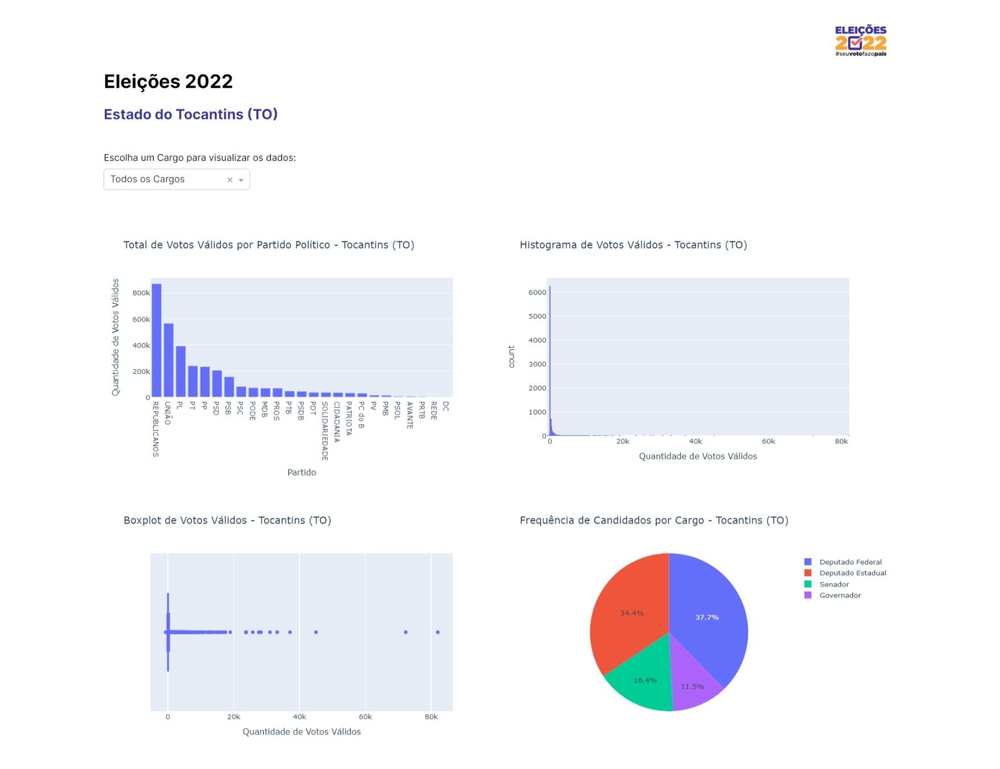

# Exploratory Data Analysis and Visualization of the 2022 Election Results in Tocantins (TO)

### Overview
This repository contains an exploratory data analysis and visualization of the 2022 election results in the state of Tocantins (TO). The project was developed as part of an academic assignment.



### Project Details
- The analysis focused on basic exploratory data techniques applied to the election results dataset.
- The state of Tocantins (TO) was randomly assigned for this study.
- Data visualization included fundamental elements such as tables, charts, and an interactive dashboard.
- The interactive dashboard was built using **Plotly Dash**, running locally from a **Jupyter Notebook**.
- The project received **full marks** for its execution and presentation.


### Course Information
Created for the Data Visualization course, taught by Prof. Dr. Sérgio Côrtes at IESB.


### Requirements
To run this project, install the required dependencies:
```
pip install pandas plotly dash jupyter
```

### Usage
To start the interactive dashboard, run the Jupyter Notebook containing the Dash application.


### License
This project is released under the GNU-3 License.
